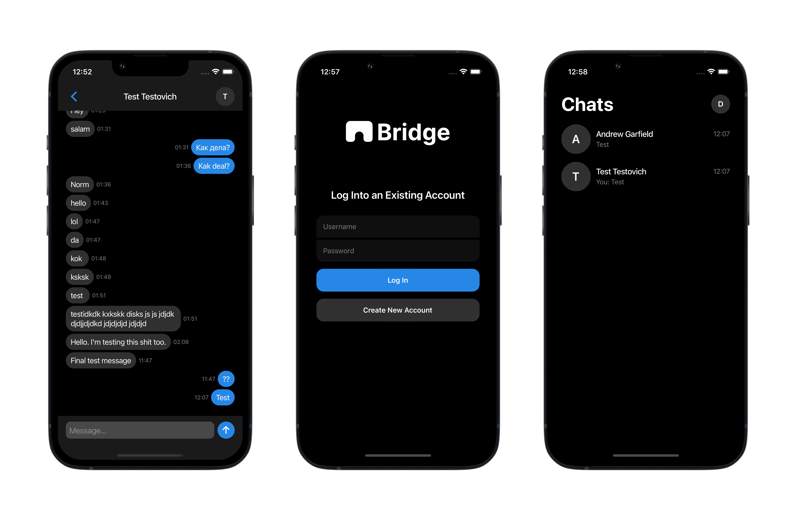

# Bridge



## About the Project

React Native messenger created for learning purposes.

Add chats, send messages and recieve them immediatly.

[API GitHub Repository](https://github.com/sloning/messanger)

### Built With

- Expo
- React Native
- Redux
- TypeScript
- Stomp & WebSocket API
- Husky
- Prettier

## Installation and Usage

```
npm install
```

To make the pre-commit hook work, you need to run `npm install` when the project is already initialized as a Git repository.

If the project is initialized as a repository later, you need to additionally execute `npm run prepare`.

```
npm start
```

## Contact

Dmitry Sviridov  
Telegram: [slamach](https://t.me/slamach)  
Email: sviridov.dvv@gmail.com
